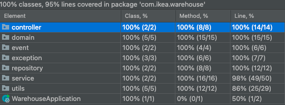
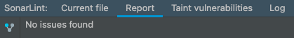

Developer: Tolga Atmaca

Date: 14.02.2021

## Application Requirements:

- Git
- Java 11+ -
- Maven 3.8.x
- Postman (nice to have)

## About Application

Warehouse is a simple warehouse management application.

Features:

- Import inventory and products from file
- Get articles
- Get products and stocks
- Get specific product by name
- Sell product by name

## How-to start application?

1 - Clone the project from GIT repository.

2 - Build application with the following command:

    mvn clean install

3 - Run the application with the following command:

    mvn spring-boot:run

4 - Follow one of the following ways to call endpoints:

- Import provided `Warehouse.postman_collection.json` Postman Collection file to Postman and call endpoints.
- Manually call endpoints.

* Application loads `inventory.json` and `product.json` files from the classpath. Those paths could be specified by the
  following environment variables:
    - `PRODUCT_FILE_PATH`
    - `INVENTORY_FILE_PATH`

## Available endpoints:

### Get Articles:

    localhost:8080/products

### Get Products

    localhost:8080/articles

### Get Product Dining Table

    localhost:8080/products/Dining Table

### Get Product Dining Chair

    localhost:8080/products/Dining Chair

### Sell Dining Table

    localhost:8080/products/Dining Table

### Sell Dining Chair

    localhost:8080/products/Dining Chair

## Unit Tests

Below image demonstrates the code coverage of Unit Tests:

## Code Quality

For the code quality, basic principles followed. Additionally, SonarLint analysis checked.

## Future Works:

Below features could be added to the application:

- Implement a database and persist products and inventories to that database,
- Implement an endpoint to add a product
- Implement an endpoint to add an inventory